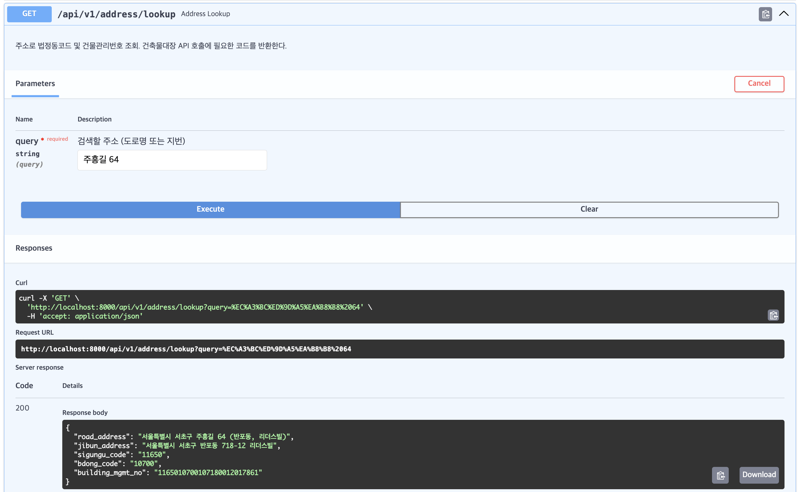
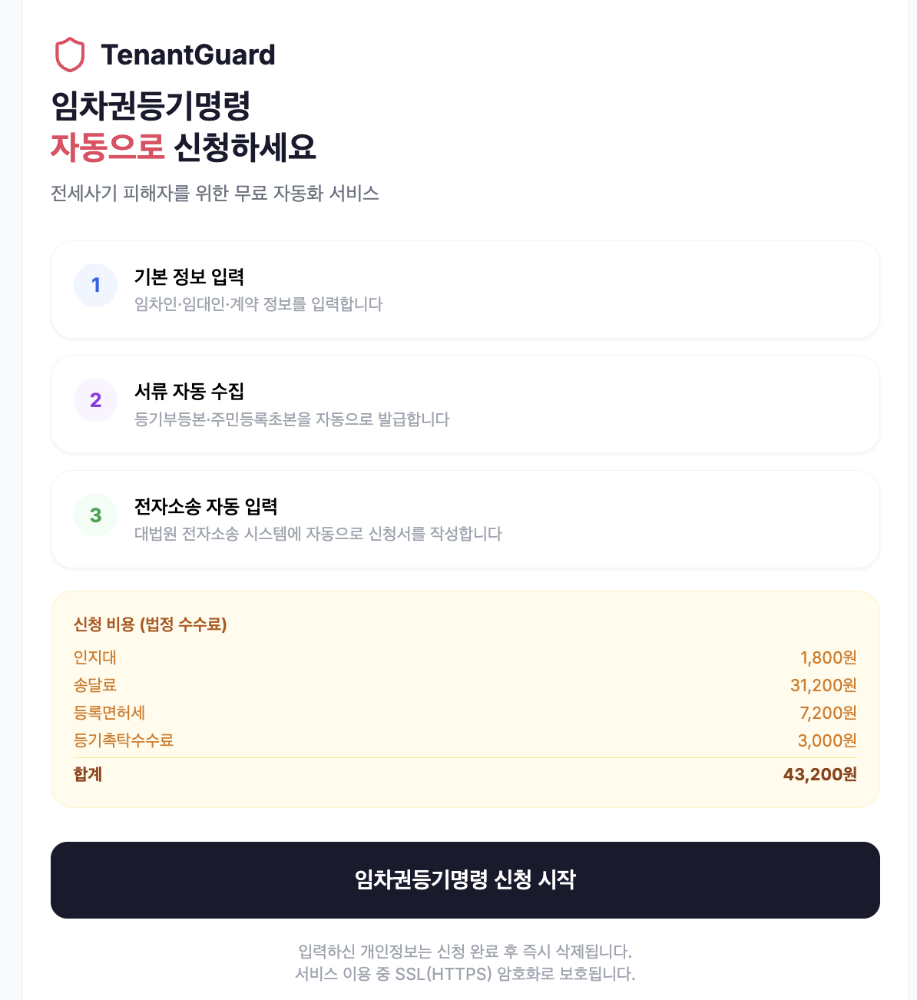
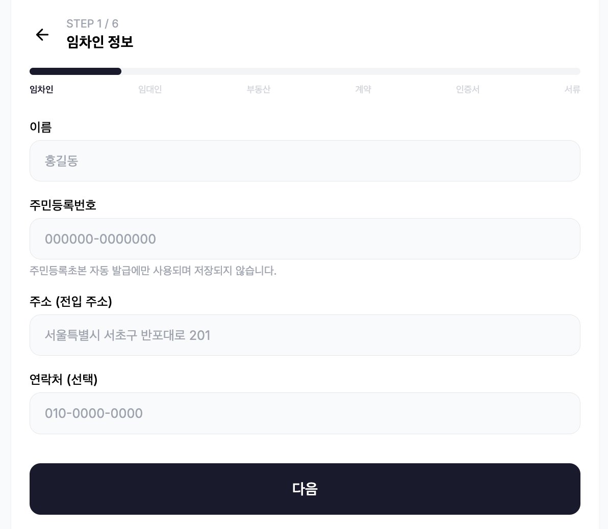

# TenantGuard — 임차권등기명령 자동화 시스템

전세사기 피해자를 위한 임차권등기명령 신청 자동화 서비스.

공동인증서 + 기본 정보 입력만으로 필요 서류를 자동 수집하고 대법원 전자소송에 신청서를 자동 제출합니다.

---

## TODO

1. 건축물 대장, 정부24, 인터넷 등기소 API 연결 (15%)
2. 소셜 로그인 구현 (Kakao, Naver) (0%)
3. JWT 토큰을 사용한 보안 강화 (0%)
4. Refactoring for Next.js code (30%)
    - 반응형 웹앱 구현
5. Oracle Cloud Infrastructure (0%)

## 구현

### Backend

#### 도로명 주소



### Frontend

#### Next.js




## 접속 포트

`docker compose up --build` 실행 후 사용 가능한 엔드포인트:

| 서비스 | URL | 용도 |
|--------|-----|------|
| **프론트엔드** | http://localhost:3000 | 사용자 UI (Next.js) |
| **Swagger UI** | http://localhost:8000/docs | API 문서|
| **Celery Flower** | http://localhost:5555 | 비동기 작업 모니터링 |
| **MinIO 콘솔** | http://localhost:9001 | 수집 서류 파일 관리|

---

## Skills

### Celery

> 오래 걸리는 작업의 비동기 처리

    - HTTP 요청 안에서 동기적으로 처리하면 
        - 브라우저 자동화 1건당 수십 초 소요 -> 요청 타임아웃 발생
        - 사용자가 응답을 그디라니는 동안 아무것도 할 수 없음
        - 서버 스레드가 모두 잠김 -> 다른 요청 처리 불가

- Celery는 이 작업들은 백그라운드 Worker로 분리합니다

사용자 요청 -> FastAPI (즉시 응답) -> `Celery Task 큐` -> `Worker가 비동기 처리`

---

### MiniO

> Worker간 파일 공유 스토리지

|방법|문제점|
|--|--|
|서버 로컬 디스크|Worker가 여러 대면 파일 공유 불가, 재시작 시 소실|
|DB (PostgreSQL)|바이너리 파일 저장에 부적합, 느림|
|AWS S3|실제 비용 발생, 로컬 개발 복잡|
|MiniO|S3 호환 API, Docker로 로컬 실행, 무료|
---

## 비용 분석

### 사용자 부담 법정 수수료 (건당 고정)

| 항목 | 금액 |
|------|------|
| 인지대 | 1,800원 |
| 송달료 | 31,200원 |
| 등록면허세 | 7,200원 |
| 등기촉탁수수료 | 3,000원 |
| **합계** | **43,200원** |

### 서비스 운영 API 비용

| API | 비용 | 일일 한도 |
|-----|------|-----------|
| 도로명주소 API | 무료 | 1,000건/일 |
| 건축물대장 API | 무료 | 1,000건/일 |
| 정부24 OpenAPI | 무료 | 1,000건/일 |
| 인터넷등기소 (Playwright) | **700원/건** (법정 수수료) | 제한 없음 |

---

## API 키 발급

### 필수

| API | 발급 URL | `.env` 키 | 발급 |
|-----|----------|-----------|---| 
| **도로명주소** | https://business.juso.go.kr/addrlink/addrLinkApi.do | `JUSO_API_KEY` |**O**|
| **건축물대장** | https://www.data.go.kr → "건축물대장정보 서비스" 검색 | `BUILDING_API_KEY` |X|

### 선택

| API | 발급 URL | `.env` 키 | 발급 |
|-----|----------|-----------|--|
| 정부24 OpenAPI | https://www.data.go.kr → "정부24" 검색 | `GOV24_API_KEY` | X |

---

## 자동화 범위

| 서류 | 수집 방법 | 비용 |
|------|-----------|------|
| 건물등기사항증명서 | **Playwright** → iros.go.kr | 700원/건 (법정) |
| 법인등기사항증명서 | **Playwright** → iros.go.kr | 700원/건 (법정) |
| 주민등록초본 | **Playwright** → plus.gov.kr | 무료 |
| 건축물대장 | **OpenAPI** → data.go.kr | 무료 |
| 임대차계약서 | 사용자 업로드 + OCR 분석 | — |
| 계약해지통지서 | 사용자 업로드 + OCR 분석 | — |

> ⚠️ Playwright 크롤러는 실제 사이트 DOM에 의존합니다. 사이트 UI 변경 시 셀렉터 업데이트 필요.

---

## 아키텍처

```
[브라우저]
    │ HTTPS
    ▼
[Next.js :3000]
    │ REST + WebSocket
    ▼
[FastAPI :8000]
   ├─ POST /api/v1/applications          신청 생성
   ├─ GET  /api/v1/applications/{id}/status
   ├─ POST /api/v1/applications/{id}/documents
   ├─ GET  /api/v1/connectivity          외부 API 연결 확인
   ├─ GET  /api/v1/address/lookup
   └─ WS   /api/v1/applications/{id}/ws
        │
        ▼
[Celery Worker]
   ├─ collect_documents
   │   ├─ IROSCrawler      ──── Playwright → iros.go.kr    (등기부등본)
   │   ├─ GOV24Crawler     ──── Playwright → plus.gov.kr   (주민등록초본)
   │   └─ BuildingLedgerApiClient ── OpenAPI → data.go.kr  (건축물대장)
   ├─ analyze_documents    ──── PaddleOCR / Tesseract
   └─ delete_application_data   제출 후 개인정보 즉시 삭제

[Redis :6379]     [PostgreSQL :5432]   [MinIO :9000/:9001]
세션/인증서        메타데이터            수집 서류 PDF
(30분 TTL)        (익명 통계)           (1시간 TTL)
```

---

## 로컬 실행

```bash
# 1. 환경변수 설정
cp backend/.env.example backend/.env
# JUSO_API_KEY, BUILDING_API_KEY 입력

# 2. 전체 스택 실행
docker compose up --build

# 3. DB 마이그레이션
docker compose exec api python -m alembic upgrade head

# 4. 연결 확인
curl http://localhost:8000/api/v1/connectivity
```

---

## 보안 정책

| 데이터 | 처리 방식 |
|--------|-----------|
| 공동인증서 | Redis 5분 TTL → 사용 후 즉시 삭제 |
| 주민등록번호 | 크롤링에만 사용, DB 미저장 |
| 수집 서류 | MinIO 1시간 TTL, 제출 후 즉시 삭제 |

---

## 작업 이력

| 날짜 | 작업 내용 | WHY |
|------|-----------|--|
| 2026-04-26 | 프로젝트 초기 설계 및 전체 스택 구현 |
| 2026-04-26 | 건축물대장: Playwright 제거 → OpenAPI(data.go.kr) 전환 | OpenAPI 있음|
| 2026-04-26 | 인터넷등기소: CODEF 제거 → Playwright(iros.go.kr) 유지 | CODEF 비용 발생|
| 2026-04-26 | 정부24 URL 수정 (www.gov.kr → plus.gov.kr) |
| 2026-04-26 | 연결 테스트 엔드포인트 추가 (GET /api/v1/connectivity) |
| 2026-04-26 | 프론트엔드 tsconfig.json @/ alias 수정 |

---

## Reference

- [도로명주소 개발자센터](https://www.juso.go.kr/addrlink/devAddrLinkRequestGuide.do)
- [공공데이터포털 — 건축물대장](https://www.data.go.kr)
- [인터넷등기소](https://www.iros.go.kr)
- [대법원 전자소송](https://ecfs.scourt.go.kr)
